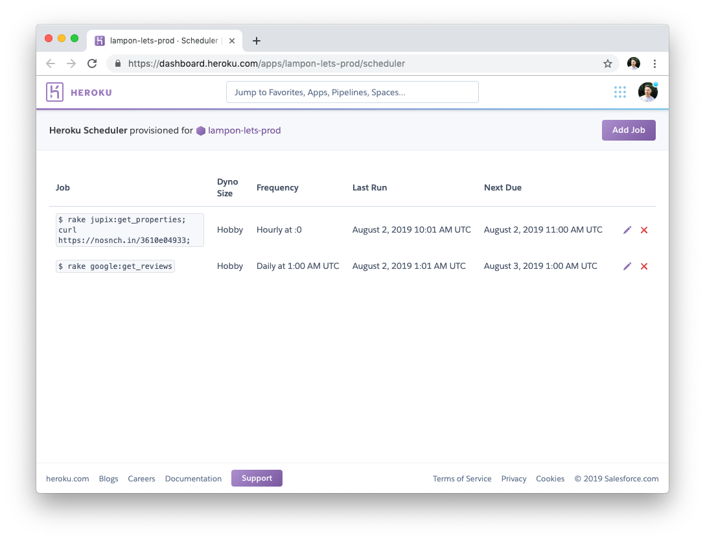
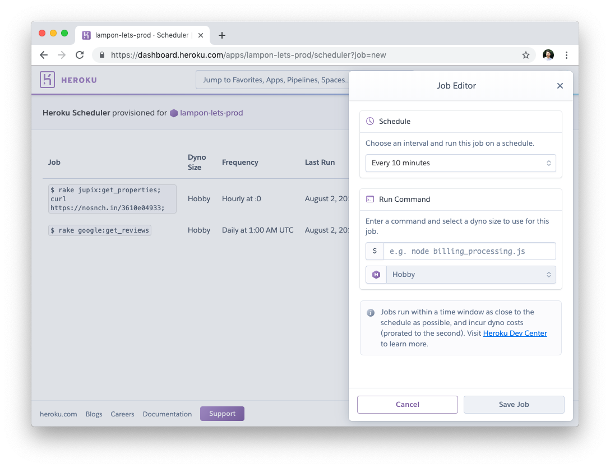

# Design Exercise

### Overview

The design challenge is part of the Design Team interview process at Heroku. The intent of the challenge is to test creative thinking, product decision making, visual design talent and communication skills.  Candidates are encouraged to spend 3 hours on this task. Candidates can work in whatever medium they feel best demonstrates their skills. We use Sketch internally but welcome HTML prototypes, Google Slides, Figma etc.

Below we have outlined a design brief for a hypothetical redesign of the [Heroku Scheduler](https://devcenter.heroku.com/articles/scheduler) product. The scenario proposed is that you are working as a designer at Heroku and are being briefed for a small project.

**Outline of challenge**

* ~3 hour homework task
* 45 minutes presentation / discussion

---

### The brief

Heroku Scheduler is a product that allows developers to execute jobs to a schedule; for example, I might want to run a database task (rake db:pull_latest) every 2 hours. Heroku Scheduler can be thought of as a more user friendly interface to [cron](https://en.wikipedia.org/wiki/Cron)).

The current release of the Scheduler UI displays jobs in a tabular layout. Through discussions with customers, the product manager for Scheduler has suggested that a designer explore a new concept for the user interface that better communicates the temporal nature of the scheduled jobs. The product manager has suggested the following issues with the current design:

* Hard to differentiate very frequent jobs with those that run less frequently
* No sense of whether previous tasks exited successfully or failed
* Times for 'last run' and 'next due' could be relative to the user to help comprehension
* Users would like to make jobs temporarily inactive without having to delete them entirely
* Does not scale well for small width layouts

As well as a product manager, an engineering architect has also been briefed on the next iteration of work for Heroku Scheduler. They have been tasked with proposing the new API for Scheduler to support some of the requested features.

The architect has attached their working version of the new API to the resources section of this document so that it may help with the design process and for your feedback.

The team is looking forward to discussing your concepts.

---

### Resources

**Sketch template & fonts**

Included in the `/resources` folder of this repo is a Sketch template with some basic elements picked from our design kit.

**Screenshots of current Scheduler**




**API Proposal**
```json
// GET /scheduled-jobs

{
    "scheduledTasks": [
        {
            "job": "rake db:pull_updates",
            "frequency": "Every 2 hours",
            "nextDueAt": "August 2, 2019 2:01 AM UTC",
            "isActive": false, // Users can make jobs inactive
            "previousJobs": [{
                "job": "rake db:pull_updates",
                "runAt": "August 2, 2019 1:01 AM UTC",
                "exitCode": 0, // Successful. 1 if unsuccessful
            },...]
        }
        ...
    ],
    "user": {
        "currentUser": "alasdair.monk@gmail.com",
        "userTimezone": "BST"
    }
}
```

